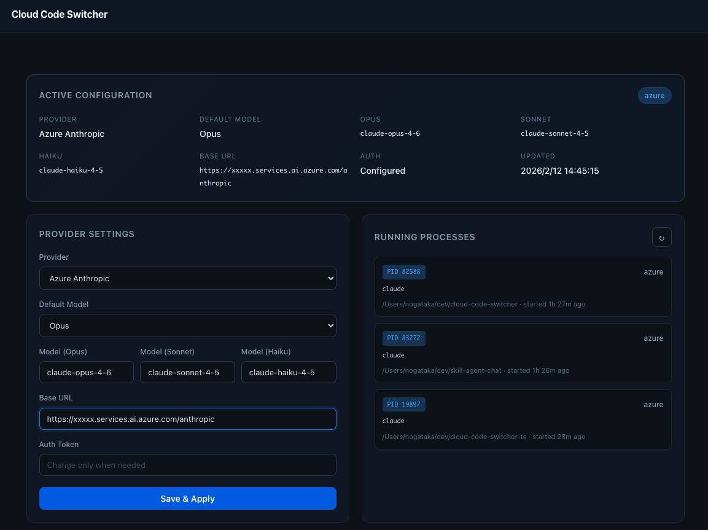

# cloud-code-switcher

Claude Code のプロバイダーを CLI / Web UI から切り替えるツールです。



## 対応プロバイダー

| ID | プロバイダー | 認証 |
|----|-------------|------|
| `claude` | Claude (Default) | 不要 |
| `azure` | Azure Anthropic (Foundry) | 必要 |
| `glm` | GLM (Zhipu AI) | 必要 |
| `ollama` | Ollama (Local) | 不要 |
| `kimi` | Kimi (Moonshot) | 必要 |
| `custom` | Custom Provider | 必要 |

## インストール

```bash
npm install -g @nogataka/cloud-code-switcher
```

## 使い方

### 現在の設定を表示

```bash
cc-switch show
```

```
provider: claude
default_tier: sonnet
model: claude-opus-4-1
model_opus: claude-opus-4-1
model_sonnet: claude-opus-4-1
model_haiku: claude-opus-4-1
base_url: -
auth: missing
updated_at: 2025-01-01T00:00:00.000Z
```

### シェル環境変数をエクスポート

```bash
eval "$(cc-switch env)"
```

現在の設定に基づいた `export` / `unset` コマンドを出力します。
`.bashrc` / `.zshrc` に追加すれば、シェル起動時に自動適用できます。

```bash
# ~/.bashrc or ~/.zshrc
eval "$(cc-switch env)"
```

### Web UI を起動

```bash
cc-switch ui
```

ブラウザが開き、GUI でプロバイダーやモデルを切り替えられます。

| 環境変数 | 説明 | デフォルト |
|---------|------|-----------|
| `CC_SWITCH_HOST` | リッスンアドレス | `127.0.0.1` |
| `CC_SWITCH_PORT` | リッスンポート | `8787` |

### プロバイダー環境で claude を起動

```bash
cc-switch run
```

設定済みの環境変数を付与して `claude` を起動します。
引数はそのまま `claude` に渡されます。

```bash
# claude を起動
cc-switch run

# オプション付きで起動
cc-switch run --dangerously-skip-permissions
cc-switch run --model sonnet
```

## 設定ファイル

状態は `~/.config/cloud-code-switcher/state.json` に保存されます。

```json
{
  "provider": "claude",
  "default_tier": "sonnet",
  "model": "claude-opus-4-1",
  "model_opus": "claude-opus-4-1",
  "model_sonnet": "claude-opus-4-1",
  "model_haiku": "claude-opus-4-1",
  "base_url": null,
  "auth_token": "",
  "updated_at": "2025-01-01T00:00:00.000Z"
}
```

## 開発

### セットアップ

```bash
# リポジトリをクローン
git clone https://github.com/your-name/cloud-code-switcher.git
cd cloud-code-switcher

# 依存関係のインストール
npm install

# ビルド (esbuild)
npm run build
```

### 開発時の実行方法

グローバルインストールせずにローカルで動作確認するには `npm run dev` を使います。
`cc-switch` コマンドの代わりに `npm run dev` の後にサブコマンドを指定してください。

```bash
# ヘルプを表示
npm run dev

# 現在の設定を表示
npm run dev show

# シェル環境変数をエクスポート
npm run dev env

# Web UI を起動
npm run dev ui

# プロバイダー環境で claude を起動
npm run dev run
npm run dev run -- --dangerously-skip-permissions
```

### プロジェクト構成

```
src/          TypeScript ソースコード
bin/          エントリポイント (bin/cc-switch.js)
dist/         ビルド出力 (esbuild)
static/       Web UI の静的ファイル
```

### 設定ファイルの場所

開発時もグローバルインストール時も、設定は同じパスに保存されます。

| ファイル | 内容 |
|---------|------|
| `~/.config/cloud-code-switcher/state.json` | プロバイダー設定・モデル情報 |
| `~/.config/cloud-code-switcher/processes.json` | `run` で起動したプロセスの管理 |

## ライセンス

MIT
